# 基于 C 语言的跨平台智能英语单词记忆系统 —— 课程设计报告

---

## 摘要

本文阐述了一款面向英语学习者的桌面级单词记忆软件的设计与实现。系统采用 **C11 标准**与 **raylib 多媒体图形库**构建，通过**即时模式图形用户界面（Immediate Mode GUI）**范式，在 Linux、Windows 及 macOS 平台实现一致的交互体验。系统核心包含用户账户管理、单词库维护、多模式智能复习、自适应学习计划及跨语言文字渲染五大子系统。设计上遵循**全局单例状态管理**与**函数指针驱动导航**的架构模式，以纯文本管道分隔文件实现轻量级数据持久化，不依赖外部数据库引擎，真正做到零配置、开箱即用。

**关键词：** 即时模式 GUI；间隔重复；C11；跨平台图形应用；自适应学习系统

---

## 一、系统总体架构

### 1.1 架构概览

系统采用 **分层单向依赖** 架构，自底向上分为数据层、业务逻辑层、UI 基础组件层与页面展示层。各层之间通过全局单例状态对象 `AppState` 进行数据共享，避免跨层指针传递。

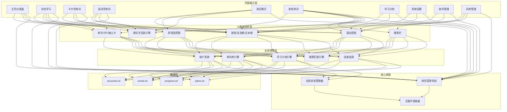

### 1.2 系统启动流程

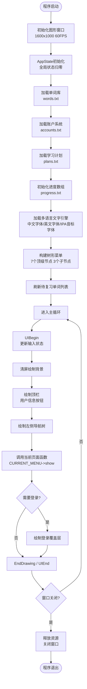

### 1.3 模块依赖关系

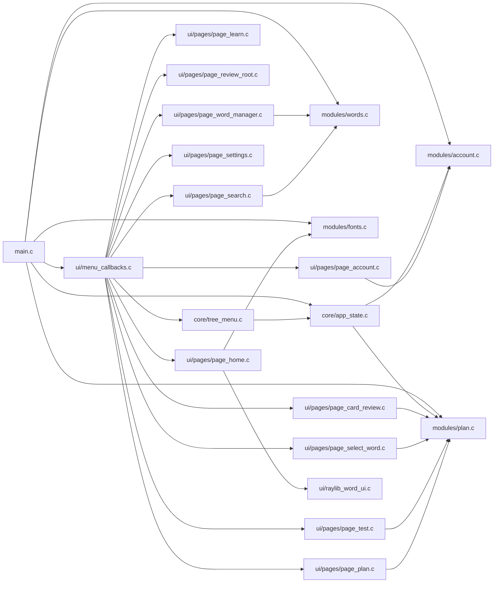

---

## 二、核心控制模块

### 2.1 全局状态管理器（core/app_state.c）

作为整个系统的**数据中枢**，`AppState` 采用单例模式将所有可变运行时状态统一管理。各业务模块通过依赖注入方式持有指向其子状态的指针，实现低耦合数据共享。

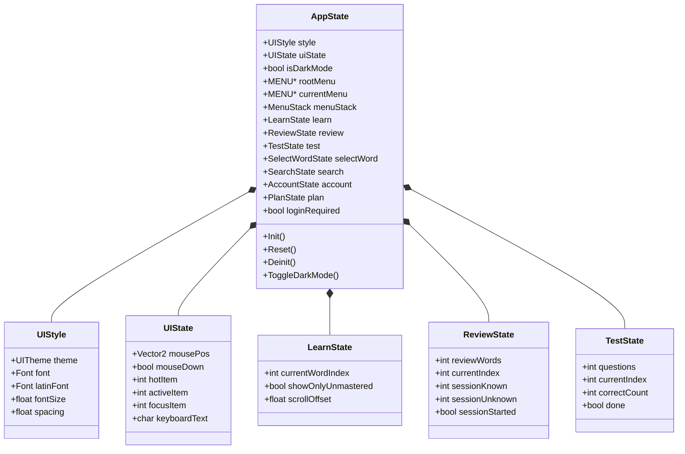

**设计优势：** 传统的面向对象做法会为每个对话框分配独立状态对象，导致跨页面状态共享困难。采用全局单例后，从"浏览学习"页面切换到"抽认卡"页面时，无需序列化/反序列化状态，只需切换导航指针即可。

### 2.2 树形菜单导航（core/tree_menu.c）

系统采用 **多路树数据结构** 组织页面导航。每个菜单节点持有一个 `show` 函数指针，运行时通过 `CURRENT_MENU->show()` 多态调用对应页面的渲染函数。

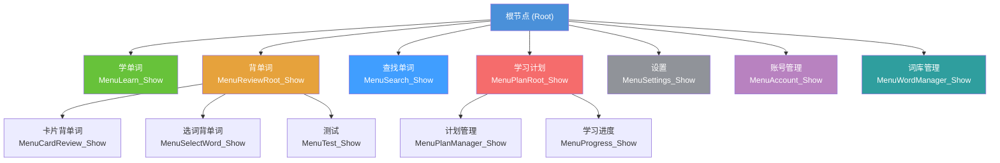

**导航栈机制：**

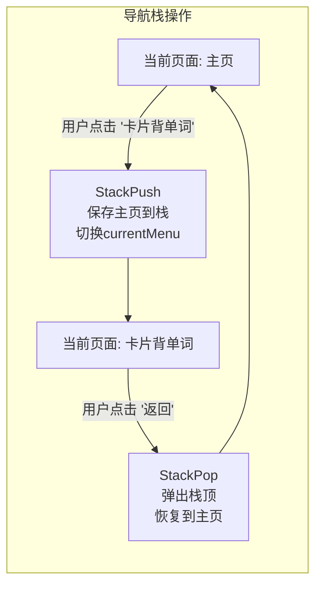

数据结构定义：

```c
typedef struct menu {
    void (*show)(void);          // 页面渲染函数指针 —— 实现多态导航
    struct menu* child[8];       // 子节点数组，最大出度 8
    struct menu* parent;         // 父节点指针，支持回溯
    int childindex;              // 已挂载子节点计数
} MENU;

typedef struct {
    MENU* menuStack[10];         // 最大深度 10 层的导航栈
    int Stacktop;                // 栈顶指针，-1 表示空栈
} MenuStack;
```

---

## 三、业务逻辑模块

### 3.1 用户账户系统（modules/account.c）

实现多用户隔离的账户管理，支持注册、登录、注销与销户操作。密码采用 **djb2 哈希算法** 存储摘要，避免明文泄露风险。

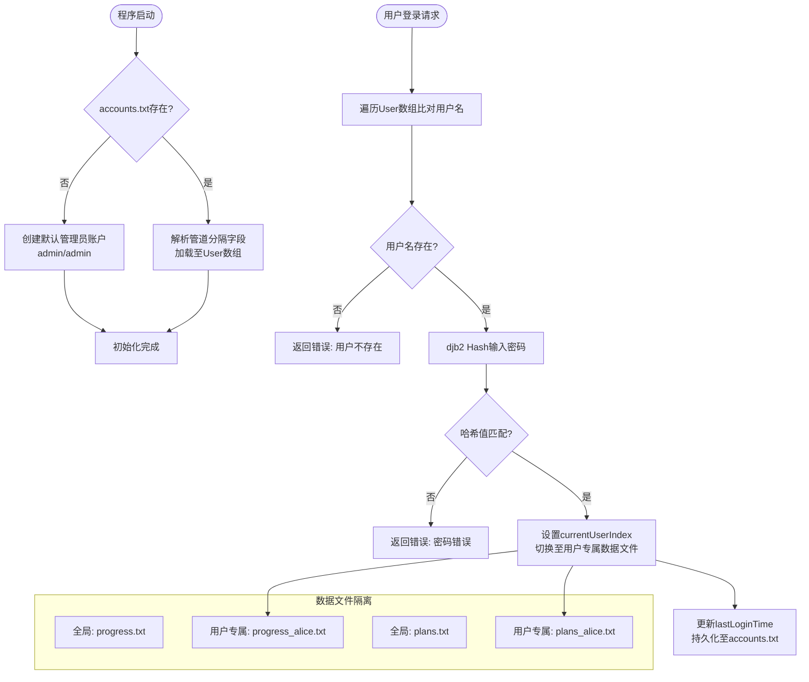

**密码安全设计：** djb2 哈希算法虽非密码学安全级别（如 bcrypt），但相比明文存储，有效防止了直接查看配置文件导致的密码泄露。其轻量级特性避免了外部加密库依赖，适合本地桌面应用场景。

### 3.2 单词库引擎（modules/words.c）

实现单词数据的 CRUD 操作、无序索引至有序进度数组的映射、以及基于通配符的模糊搜索算法。

**数据映射流程：**

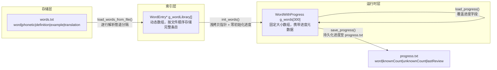

**通配符搜索算法：**

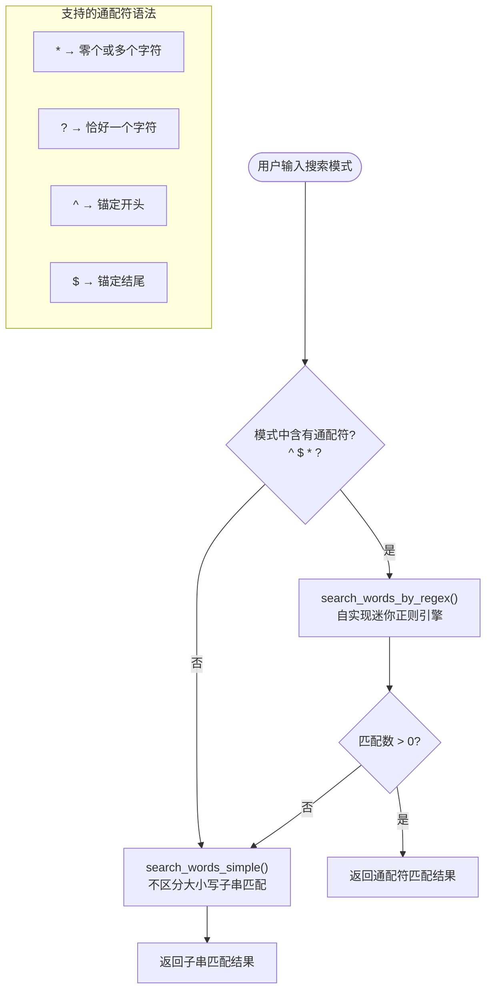

**检索示例：**
| 输入模式 | 匹配逻辑 | 示例匹配 |
|----------|---------|---------|
| `ab*` | 以 "ab" 开头 | abandon, abstract |
| `*tion` | 以 "tion" 结尾 | education, information |
| `h?t` | "h" + 任一字符 + "t" | hat, hit, hot |
| `^test` | 精确开头为 "test" | test, testing |

### 3.3 学习计划引擎（modules/plan.c）

实现自适应学习计划管理，支持计划的创建、激活与**跨日期自动推进**。

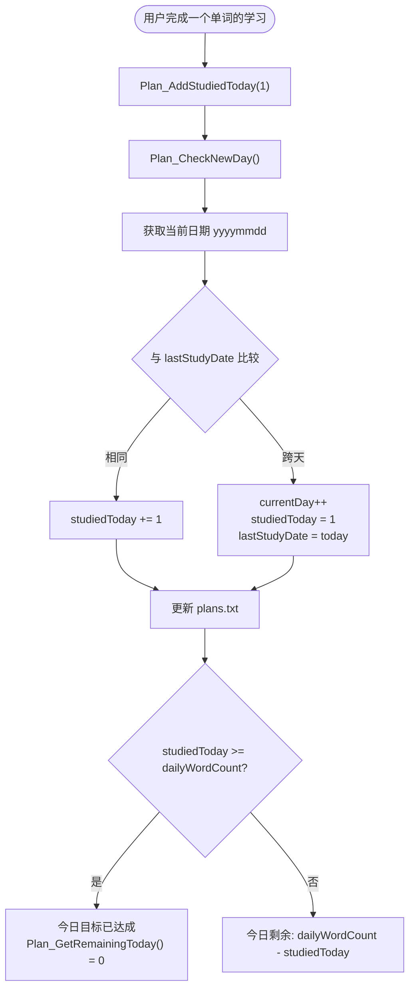

**四大预设学习方案：**

| 计划名称 | 每日单词量 | 总天数 | 累计覆盖 |
|---------|-----------|-------|---------|
| 一周入门计划 | 10 词/天 | 7 天 | 70 词 |
| 半月巩固计划 | 15 词/天 | 15 天 | 225 词 |
| 三十天进阶计划 | 20 词/天 | 30 天 | 600 词 |
| 六十天冲刺计划 | 30 词/天 | 60 天 | 1800 词 |

### 3.4 复习策略与进度追踪

系统采用**类间隔重复（Spaced Repetition）** 策略跟踪每个单词的学习状态。

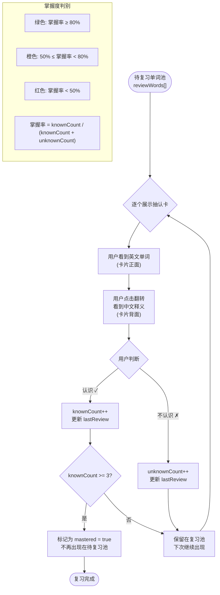

---

## 四、UI 基础组件层

### 4.1 即时模式 GUI 系统（ui/raylib_word_ui.c）

本系统采用**即时模式（Immediate Mode）** GUI 范式，区别于传统的保留模式（Retained Mode）。每个 UI 控件以函数的形式存在，在同一调用中同时完成输入处理与视觉渲染。

**即时模式核心原理：**

```mermaid
flowchart TD
    subgraph 保留模式 (Qt/GTK)
        R1[创建控件对象] --> R2[设置属性/回调]
        R2 --> R3[控件持有状态]
        R3 --> R4[事件循环驱动更新]
    end

    subgraph 即时模式 (本系统)
        I1["每帧调用 UIButton()"]
        I1 --> I2["检查鼠标是否在按钮区域"]
        I2 --> I3["更新 hotItem / activeItem"]
        I3 --> I4["根据状态选择颜色绘制"]
        I4 --> I5["返回是否被点击"]
    end
```

**热点系统状态机：**

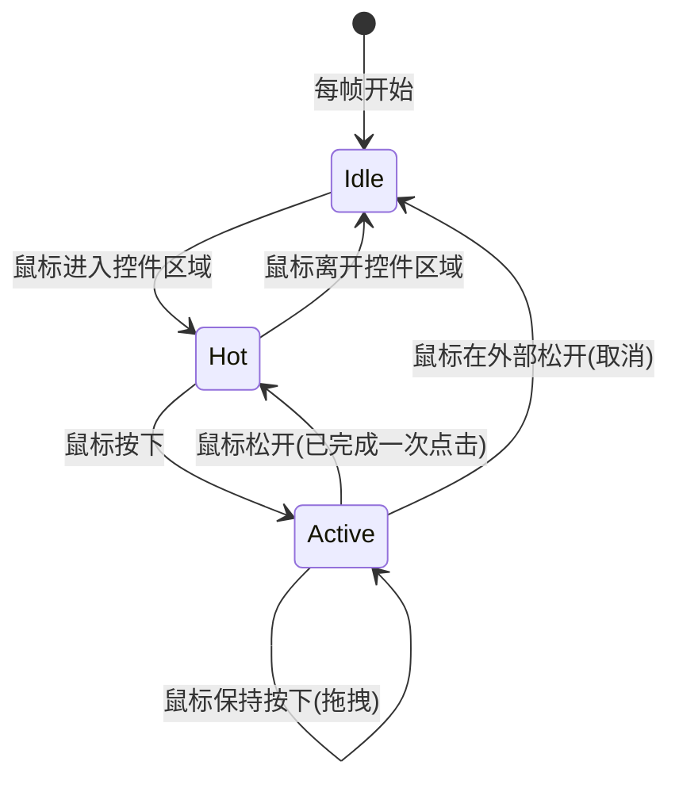

**UI 主题系统：**

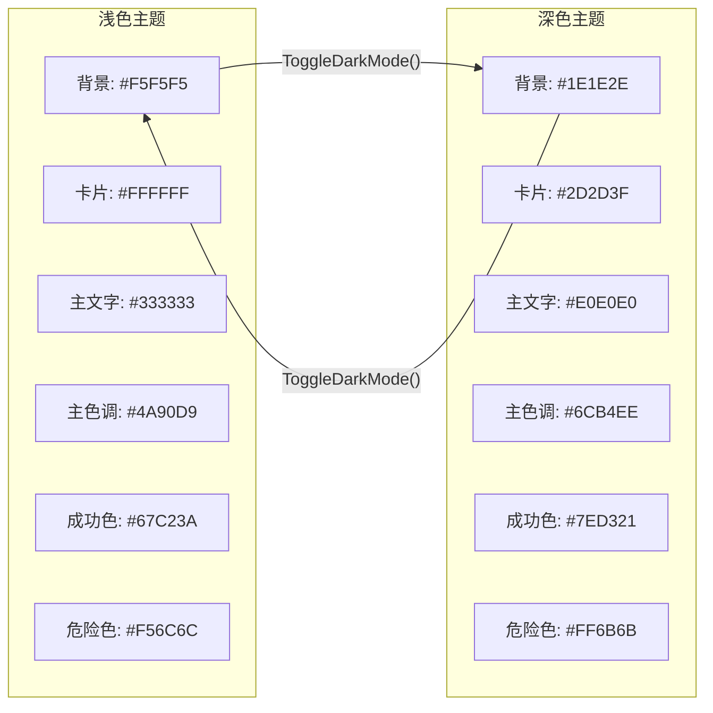

### 4.2 多语言文字渲染引擎（modules/fonts.c）

针对中英混排场景，实现了**基于 Unicode 码位的动态字体切换**渲染引擎。

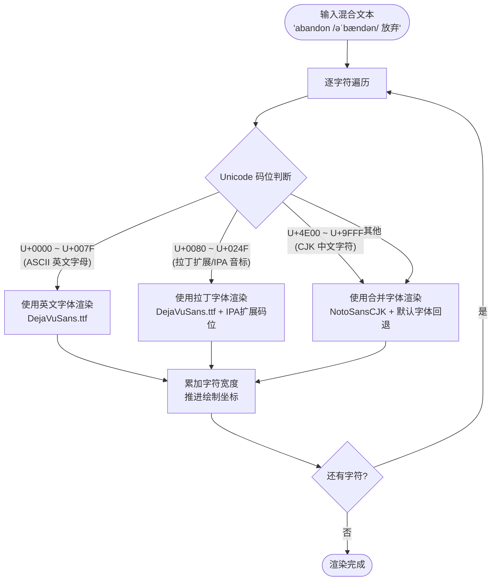

**字体后备链设计：**

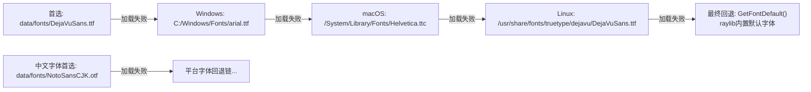

### 4.3 抽认卡翻转动画

卡片背单词功能采用**三维仿射变换**模拟卡片翻转效果：

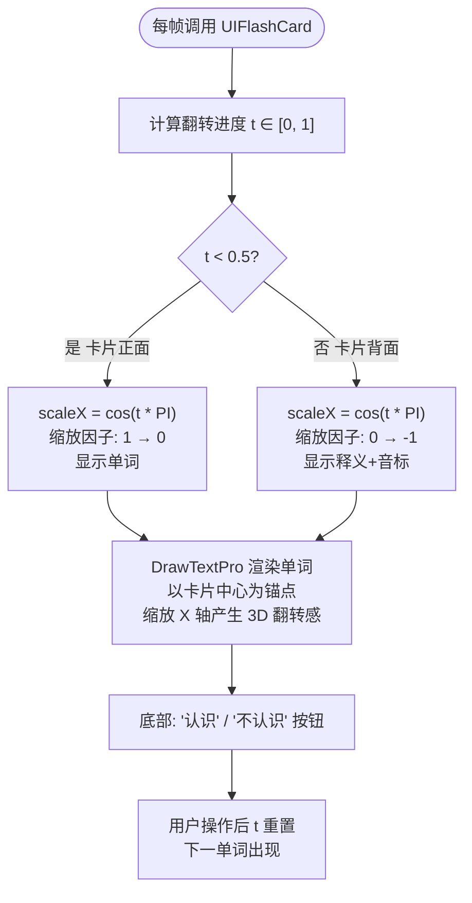

---

## 五、功能页面模块

### 5.1 页面职能矩阵

| 页面模块 | 核心功能 | 涉及的数据操作 | 学习计划联动 |
|---------|---------|--------------|------------|
| **主页仪表盘** | 全局统计概览 + 快捷入口 | 遍历 g_words[] 统计进度 | 读取活跃计划进度 |
| **浏览学习** | 逐词浏览，详情展示 | 读取 WordEntry 字段 | 无 |
| **卡片背单词** | 抽认卡翻转，认识/不认识判定 | 更新 WordProgress | Plan_AddStudiedToday(1) |
| **选词背单词** | 看中文释义选英文单词 | 更新 selectWordCorrect/Total | Plan_AddStudiedToday(1) |
| **测试模式** | 看英文单词选中文释义 | 仅本地计分 | Plan_AddStudiedToday(1) |
| **查找单词** | 通配符搜索 + 子串搜索 | 读取 g_wordLibrary | 无 |
| **学习计划** | 计划创建/激活/进度总览 | 读写 plans.txt | 无 |
| **系统设置** | 深浅主题切换 | 仅修改内存状态 | 无 |
| **账号管理** | 注册/登录/注销/销户 | 读写 accounts.txt | 文件路径重定向 |
| **词库管理** | 单词 CRUD 编辑 | 读写 words.txt | 保存时同步进度 |

### 5.2 典型学习流程

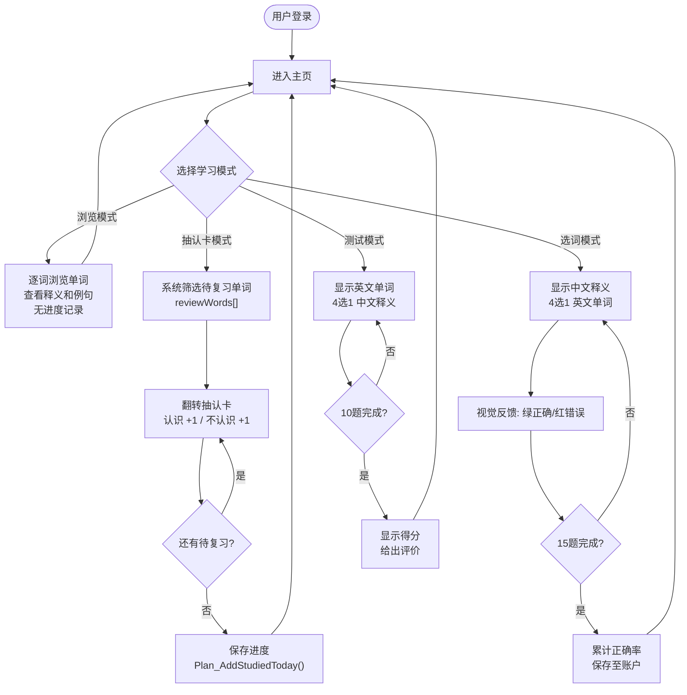

---

## 六、数据持久化方案

### 6.1 文件存储设计

系统采用**管道分隔纯文本格式**作为存储方案，避免引入 SQLite 等外部依赖，确保可读性、可编辑性和零配置部署。

| 文件 | 字段结构 | 编码 |
|------|---------|------|
| `words.txt` | `word\|phonetic\|definition\|example\|translation` | UTF-8 |
| `accounts.txt` | `username\|passwordHash\|createdTime\|lastLoginTime\|correct\|total` | UTF-8 |
| `progress.txt` | `word\|knownCount\|unknownCount\|lastReview` | UTF-8 |
| `plans.txt` | `name\|dailyWordCount\|totalDays\|currentDay\|createdAt\|lastStudyDate\|studiedToday\|isActive` | UTF-8 |

### 6.2 多用户数据隔离方案

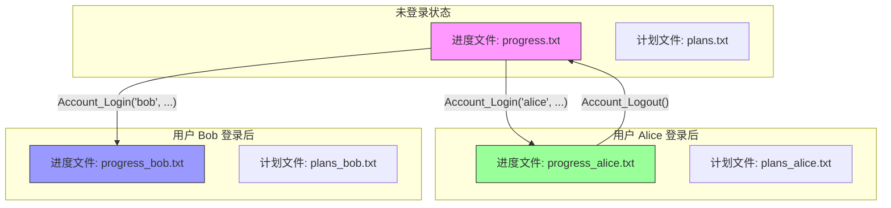

---

## 七、跨平台构建与发布

### 7.1 构建系统架构

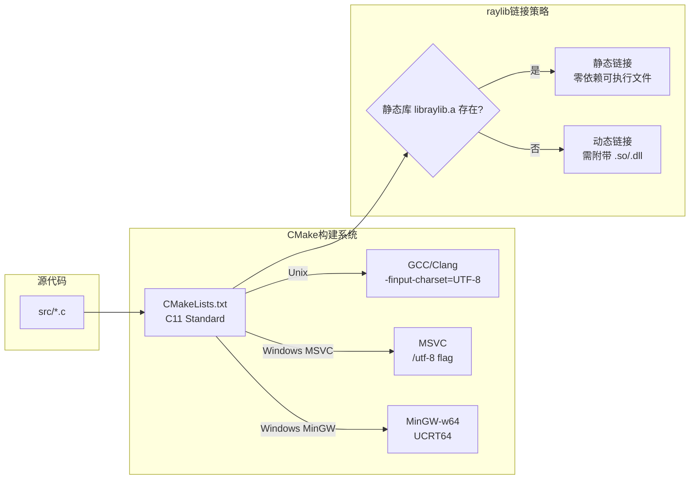

### 7.2 CI/CD 自动发布管道

```mermaid
flowchart TD
    Push["推送 v* 标签"] --> Trig["触发 GitHub Actions"]

    Trig --> LinuxJob["Linux Job<br/>ubuntu-24.04"]
    Trig --> WinJob["Windows Job<br/>windows-2025 + MSYS2"]

    LinuxJob --> RaylibBuild["从源码编译 raylib 6.0<br/>静态链接"]
    RaylibBuild --> LinuxBuild["Ninja 编译项目"]
    LinuxBuild --> LinuxPkg["生成产物:<br/>1. AppImage<br/>2. tar.gz 便携版"]

    WinJob --> MSYS2Setup["MSYS2 UCRT64<br/>安装 gcc/cmake/ninja/raylib"]
    MSYS2Setup --> WinBuild["Ninja 编译项目"]
    WinBuild --> WinPkg["生成产物:<br/>zip 便携版<br/>含 exe + dll + data"]

    LinuxPkg --> Release["创建 GitHub Release"]
    WinPkg --> Release
    Release --> Done["发布三个文件:<br/>- 背单词软件-x86_64.AppImage<br/>- 背单词软件-linux-x86_64.tar.gz<br/>- 背单词软件-windows-x86_64.zip"]
```

---

## 八、关键技术决策与创新点

### 8.1 设计决策权衡

| 决策 | 选择 | 理由 | 代价 |
|------|------|------|------|
| GUI 范式 | 即时模式 | 无对象生命周期管理；代码量少 60%；状态完全显式 | 每帧重绘全部控件，CPU 消耗略高；长文本需每帧测量 |
| 数据存储 | 纯文本管道分隔 | 零依赖；用户可用记事本编辑；版本控制友好 | 无并发支持；无索引查询，大数据量下性能较差 |
| 语言 | C11 | 极致性能；极小二进制体积；与 raylib C API 无缝对接 | 无 STL，需手工管理字符串与动态数组 |
| 密码安全 | djb2 哈希 | 无外部加密库依赖；比明文安全 | 非密码学安全级别，不适用于网络传输场景 |
| 字体渲染 | 自研 DrawTextAuto | 完美解决中英混排问题；无额外库依赖 | 维护成本；字体后备链需针对各平台调优 |

### 8.2 创新亮点

1. **即时模式 GUI + 主题系统：** 在没有 GTK/Qt 等重型框架的情况下，从零实现了完整可用的图形界面组件库，支持深浅双主题一键切换。

2. **Unicode 级字体切换：** 针对 raylib 原生仅支持单一字体渲染的限制，设计了逐字符码位检测 + 动态字体切换算法，实现了 ASCII 英文、IPA 国际音标、CJK 中文字符在同一段落内的和谐共存。

3. **多用户隔离：** 通过文件路径重定向而非数据库模式字段实现了轻量级多用户数据隔离，每个用户的学习进度和计划完全独立。

4. **自适应学习计划：** 计划引擎自动感知日期跨越，无需用户手动签到即可实现 `currentDay` 推进与每日计数器重置。

---

## 九、总结

本系统以 C11 语言配合 raylib 图形库，实现了一款功能完备的跨平台英语单词记忆桌面软件。系统涵盖用户管理、单词库维护、四种学习模式、自适应计划管理等核心功能模块，通过即时模式 GUI 范式与 Unicode 级字体切换引擎，在轻量级的技术栈上实现了良好的用户体验。管道分隔纯文本文件作为数据持久化方案，确保了系统的零配置部署与高可维护性。项目通过 GitHub Actions 实现 Linux AppImage 与 Windows zip 双平台自动构建发布，具备完整的工程化交付能力。

---

## 附录 A：项目文件清单

```
Recite_English/
├── CMakeLists.txt                 # CMake 构建配置
├── build.sh                       # Linux 一键构建脚本
├── src/
│   ├── main.c                     # 程序入口 + 主循环
│   ├── core/
│   │   ├── config.h               # 全局常量定义
│   │   ├── app_state.c / .h       # 全局状态管理器
│   │   └── tree_menu.c / .h       # 树形菜单导航系统
│   ├── modules/
│   │   ├── account.c / .h         # 用户账户模块
│   │   ├── words.c / .h           # 单词库 + 进度 + 搜索
│   │   ├── plan.c / .h            # 学习计划模块
│   │   └── fonts.c / .h           # 多语言文字引擎
│   ├── ui/
│   │   ├── raylib_word_ui.c / .h  # 即时模式 GUI 组件库
│   │   ├── menu_callbacks.c / .h  # 菜单树初始化 + 导航栏
│   │   └── pages/
│   │       ├── pages.h            # 页面函数声明
│   │       ├── page_home.c        # 主页仪表盘
│   │       ├── page_learn.c       # 浏览学习
│   │       ├── page_review_root.c # 背单词入口
│   │       ├── page_card_review.c # 卡片背单词
│   │       ├── page_select_word.c # 选词背单词
│   │       ├── page_test.c        # 测试模式
│   │       ├── page_search.c      # 查找单词
│   │       ├── page_plan.c        # 学习计划管理
│   │       ├── page_settings.c    # 系统设置
│   │       ├── page_account.c     # 账号管理
│   │       └── page_word_manager.c # 词库管理
├── data/
│   ├── words.txt                  # 单词库数据
│   ├── accounts.txt               # 账户数据
│   └── fonts/                     # 字体文件
├── packaging/
│   └── AppImage/                  # AppImage 打包资源
└── .github/workflows/
    └── release.yml                # CI/CD 自动发布配置
```

## 附录 B：编译与运行

**Linux:**
```bash
./build.sh package    # 一键编译 + 打包
```

**Windows (MSYS2 UCRT64):**
```bash
mkdir build && cd build
cmake .. -G Ninja -DCMAKE_BUILD_TYPE=Release
ninja
```

**macOS:**
```bash
brew install raylib cmake ninja
mkdir build && cd build
cmake .. -G Ninja -DCMAKE_BUILD_TYPE=Release
ninja
```
